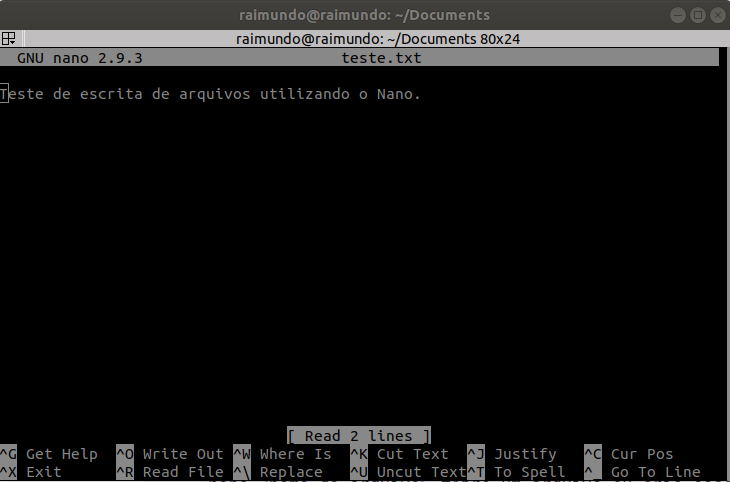

<h1 align="center"> Sobre o repositório </h1>

Este repositório foi criado para consultas rápidas sobre comandos básicos do Linux, para organização do conteúdo foi utilizado como referência o curso de **Introdução ao Sistema Linux** da plataforma **Digital Inovation One**. 

> AVISO: Este repositório apresenta apenas um conjunto de comandos básicos e explicações simplificadas, não o use como única e absoluta fonte de pesquisa!

Fique à vontade para comentar, sugerir, criticar (construtivamente) ou colaborar fazendo um fork e adicionando conteúdos que possam ser úteis e que não estão presentes no repositório.
<h1 align="center"> Terminal </h1>

É um emulador de linhas de comandos que dispensa o uso de interface gráfica e facilita a automação de processos por meio de comandos, bastante utilizado por profissionais da área de TI, e podendo ser acessado pelo atalho **CTRL + ALT + T**.

#### Comandos básicos

	pwd #Exibir o path atual.
	ls #Para listar os arquivos
	ls -l #Para listar os arquivos com mais detalhamento 
	ls -a #Para listar arquivos ocultos
	ls --help #Para consultar o manual do comando ls
	clear #Limpa a tela.
	
#### Comandos de navegação:
	
	cd~ #Para ir para o diretório home
	cd/ #Para ir para o diretório raiz.
	cd <nome_da_pasta> # Para entrar em uma pasta
	cd .. #Para sair de uma pasta
 
#### Manipular pastas e arquivos

	mkdir <nome_da_pasta> #Cria uma pasta.
	rmdir <nome_da_pasta> #Remove a pasta.
	mv <pasta1> <pasta2> #Renomear a pasta1 com o nome da pasta2
	mv <pasta1> </path> #Mover a pasta1 para o path.
	cp <arquivo_ou_pasta> <path_destino> #Copia uma pasta ou arquivo para algum path.

	totch <nome_do_arquivo> #Cria um novo arquivo.
	rm <nome_do_arquivo_ou_pasta> #Remove o arquvio ou pasta.
	rm -r <nome_da_pasta> #Remove a pasta e tudo que há nela.
	
#### Fluxo de execução

Utilize o simbolo **&** e **&&** para executar mais de um comando por vez.

	<comando1> & <comando2> #Executa dois comandos com uma quebra de execução.
	<comando1> && <comando2> #Executa dois comandos com uma mesma chamada (sem quebra do texto exibido).

Exemplos:

	pwd & ls
	pwd && ls
	mkdir pasta && cd pasta && pwd

#### Alias

Alias é basicamente um apelido (atalho) dado para um comando específico, isto pode ser útil quando temos algum comando de uso frequente e de sintaxe complexa ou grande. 

	alias teste='<algum_comando>'

Agora se usarmos o comando **teste**, o comando que foi adicionado após o sinal de igual será executado.

#### Atalhos do teclado no terminal

 - Ctrl+c : Cancela o comando atual em funcionamento (incluindo programas abertos pelo terminal).
 - Ctrl+z : Pausa o comando em execução.
 - Ctrl+d : Sai da sessão atual.
 - Ctrl+w : Apaga uma palavra da linha atual.
 - Ctrl+u : apaga a linha inteira.
 - Ctrl+r : Busca um comando recente.
 - Ctrl+l : Limpa o terminal.

#### Comandos úteis

	history #mostra histórico de comandos digitados.
	whatis <comando> #Exibe o que o comando faz.
	find <path_geral> -name <arquivo> #Retorna o path especifico do arquivo pesquisado.
	cmp <arquivo1> <arquivo2> #Compara os dois arquivos.
	dif <arquivo1> <arquivo2> #Exibe a diferença entre dois arquivos.
	sort -n <arquivo.txt> #Ordena a saída do arquivo no terminal.
	uptime #Exibe o tempo que faz que o sistema está funcionando. 
	time <comando> #Exibe o tempo que o comando levou para concluir.

<h2 align="center"> Manipulando arquivos de texto no Linux </h2>

Manipular arquivos de texto no Linux é algo importante, pois este tipo de arquivo apresenta uma estrutura simples que dispensa o uso de interface ou de programas mais avançados para serem editados, além de possibilitar em alguns casos, salvar informações, configurações, ou log de programas, etc.

#### Nano
O Nano é um editor de texto simples, baseado no terminal Linux, bastante útil principalmente em situações em que não há interface gráfica para editores mais complexos.

	nano <nome_do_arquivo> #Abre um arquivo ou cria caso o arquivo não exista.

Na imagem abaixo está a interface do Nano, na parte de baixo há os comandos necessários para manipulação de arquivos (o simbolo **^** Representa a tecla Ctrl). Pressione algum comando e em seguida tecle enter para efetivar.

#### Comandos para manipulação de arquivos de texto

Para manipulação de arquivos de texto (txt) direto no terminal.

	cat <arquivo.txt> #Para ver o que está escrito no arquivo.
	tac <arquivo.txt> #Igual o cat, porém com as ordem das linhas invertidas.
	head <arquivo.txt> #Exibe as 10 primeiras linhas do arquivo (estas linhas normalmente são utilizadas para informações de cabeçalhos)
	tail <arquivo.txt> #Exibe as 10 ultimas linhas do arquivo.
	nl <arquivo.txt> #Exibe o arquivo com o número das linhas.
	wc -l <arquivo.txt> #Exibe a quantidade de linhas do arquivo.
	wc -w <arquivo.txt> #Exibe a quantidade de palavras dentro do arquivo.
	
	
#### Redirecionamento de saída

Utilizando o simbolo **>**, é possível redirecionar a saída de um comando para um arquivo. Por exemplo:
Utilizando o comando abaixo, a saída do comando **teil** (10 ultimas linha de arquivo.txt) serão gravadas em saida.txt.

	tail arquivo.txt > saida.txt

O mesmo pode ser aplicado para qualquer comando, outro exemplo:

Agora a saída do comando **ls** (que o nome de todos os arquivo da pasta) será gravada no arquivo saida.txt.

	ls > saida.txt

Utilizando o comando **>>** o conteúdo será anexado (concatenado) ao final do arquivo de destino. Se for utilizado apenas **>**, o arquivo será sobrescrito.

#### Comando echo

O Comando **echo** é utilizado quando queremos uma saída no terminal, por exemplo se você quer que que apenas seu nome apareça no terminal, use o comando:

	echo -e "nome\n"

A flag **-e** informa que o texto de saída contêm caracteres especiais, neste caso o **\n** que simplesmente adicionar uma quebra de linha ao final do texto. O comando **echo** pode ser utilizado para adicionar textos em um arquivo de texto, por exemplo:

	echo -e "----- MEU ARQUIVO -------" >> arquivo.txt

#### Busca em arquivos

Utilizando o comando **grep** é possível realizar buscas em arquivos ou saída de comandos. Exemplo: Neste exemplo, o comando grep irá buscar pelas ocorrências da palavra "termo" dentro da saída do comando **tail arquivo.txt**.

	tail arquivo.txt | grep "termo"

Outro exemplo: Agora o comando **grep** irá retornar todas as ocorrências da palavra termo  que possuí na saída do comando **ls**.

	ls | grep "termo"

#### Leitura de arquivos

As vezes nos deparamos com arquivos ou saída de comandos com muito texto, o que dificultam a leitura, uma alternativa é usa o comando **more** ou **less**:
	
	cat arquivo.txt | more #Exibe as linhas do arquivo de forma controlável.
	<comando> | more #Exibe as linhas saída do comando de forma controlável.

	

<h2 align="center"> Outros comandos básicos </h2>

#### Informações do hardware
Primeiro vá para a pasta raiz **/** e entre na pasta **proc**
	
	cd / && cd proc

Agora digite o comando e substitua **arquivo** por algum arquivo da pasta **proc**.

	cat /proc/arquivo #exemplo
	cat /proc/cpuinfo #Informações sobre a CPU.
	cat /proc/meminfo #Informações sobre a memória.
	
Outros comandos para ver informações sobre o sistema.
	
	lshw  #Exibi todos os hardwares no computador.
	lspci #Exibi todos os hardwares conectados via PCI.
	lsusb #Exibi todos os hardwares conectados via USB.
	lscpu #Exibi todos os hardware de CPU.
	arch #Exibi a arquitetura do sistema.
	uname -a #Exibe o kenel do sistema operacional.
	free #Exibe a memória física e memória swap.
	du -h <path> #Exibe a quantidade de memória usada por cada arquivo em path.
	cat /etc/passwd #Exibe todos os usuários criado pelo usuário e pelo sistema.

#### Comandos do sistema

	reboot #Reinicia o sistema operacional.
	shutdown now #Delisga o computador (now pode ser substituido por uma hora especifica, veja o help)
	last reboot #Exibe histórico de reinicializações. 
	

#### Datas no terminal

	cal #Exibe o calendário do mês atual.
	cal 2020 #Exibe todos os meses do ano de 2020.
	cal julho 2020 #Exibe o calendário do mês julho de 2020.
	date #Exibe a data atual.

<h2 align="center"> Comandos de gerenciamento de rede </h2>

	ifconfig #Exibe detalhes das interfaces de redes.
	hostname #Exibte o nome do pc na rede local.
	hostname -I #Exibe o endereço IP na rede local.
	who #Exibe estatus da conexão com a rede.
	ping <host> #Envia mensagens de controle para um host especifico.
	dig <host> #Exibe informações sobre o DNS.
	traceroute <host> #Exibe informações dos saltos (nós) até o host informado.
	whois <host> #Exibe informações sobre um determinado host.
	finger #Exibe informações do usuário que está logado no host.
	route -n #Exibe a tabela de roteamento IP do kernel.
	
<h1 align="center"> Gerenciamento de usuários </h1>

Gerenciar usuários no Linux é algo importante, pois cada usuário pode ter privilégios diferentes e acesso a conteúdos diferentes.

	sudo adduser <nome_do_usuario> #Para adicionar um novo usuário.
	su <nome_do_usuario> #Para trocar de usuário.
	passwd <nome_do_usuario> #Para modificar a senha do usuário.
	lastlog #Informações dos logs realizados no sistema.
	last #Histórico de entrada e saída de usuários no sistema.
	logname #Exibe o nome do usuário logado no sistema.
	id #Exibe o identificador do usuário.
	sudo userdel -r <nome_do_usuario> #Remove a pasta pessoal do usuário.

Como já foi visto anteriormente, podemos ver todos os usuários com mais detalhes por meio do comando:

	cat /etc/passwd #Exibe todos os usuários criado pelo usuário e pelo sistema.

#### Grupos de usuários

	sudo addgroup <nome_do_grupo> #Cria um novo grupo.
	sudo adduser <nome_do_usuario> <nome_do_grupo> #Adicionar um usuário para o grupo.
	sudo gpasswd -d <nome_do_usuario> <nome_do_grupo> #Remove o usuário do grupo.
	sudo groupdel <nome_do_grupo> #Remove o grupo.
	
Todos os grupos podem ser visualizados com detalhes por meio do comando:
	
	cat /etc/group #Exibe informações sobre os grupos presentes no sistema.

#### Permissões

As permissões são utilizadas para restringir o acesso.

	ls -lh #Lista o conteúdo da pasta atual e os tipos de permissões do usuário sobre o conteúdo da pasta. 

As permissões normalmente são descritas por um conjunto de caracteres formado por 10 letras, a primeira letra informa se é um diretório (**d**) ou arquivo (**-**), e em seguida 9 (nove) caracteres correspondentes aos três tipos de acesso: de leitura (**r**), escrita (**w**) ou execuções (**x**), organizados em 3 tipos de usuários: O criador do arquivo, integrantes do grupo, usuários de fora do grupo. Segue um exemplo:

	-rwxrwxrwx #Exemplo onde todos os usuários podem ler, escrever ou executar um arquivo.
	drwxr--r-- #Exemplo onde apenas o dono do arquivo pode modificar enquanto os demais só podem ler.

Para modificando tipo de privilégio sobre um arquivo/pasta é utilizado uma abordagem de máscara octal em conjunto com com os grupos descrito acima.

|| Dono | Grupo | Outros |
|--|--|--|--|
| Tipo da permissão | r w x | r w x | r w x |
| Máscara octal | 4 2 1 | 4 2 1 | 4 2 1 |

Atribuindo permissões conforme a máscara:
| Valor | Permissão | Descrição |
|--|--|--|
|1            | - - x | Permissão de execução |
|2            | - w - |Permissão de escrita |
|2 + 1 = 3    | - w x |Permissão de escrita e execução |
|4            | r - - | Permissão de leitura |
|4 + 1 = 5 | r-x |Para conceder permissão de leitura e execução |
| 4 + 2 = 6 | r w - |Para conceder permissão de escrita e leitura |
|4 + 2 + 1 = 7 | r w x |Para conceder permissão de leitura, escrita e execução |

Utilizando o comando **chmod** seguido pela combinação de 3 valores conforme apresentado acima para cada tipo de usuário, logo:

	chmod 100 <arquivo/pasta> #Para conceder permissão de execução para o usuário proprietário.
	chmod 040 <arquivo/pasta>  #Para conceder permissão de leitura para os usuários do grupo.
	chmod 444 <arquivo/pasta>  #Para conceder permissão de leitura para toso os usuários.
	chmod 666 <arquivo/pasta>  #Para conceder permissão de leitura e escrita para todos os usuários.
	chmod 777 <arquivo/pasta>  #Para conceder todas as permissões para todos os usuários.
	

	

## Referências

Digital Inovation One: Linux: Introdução ao sistema operacional

